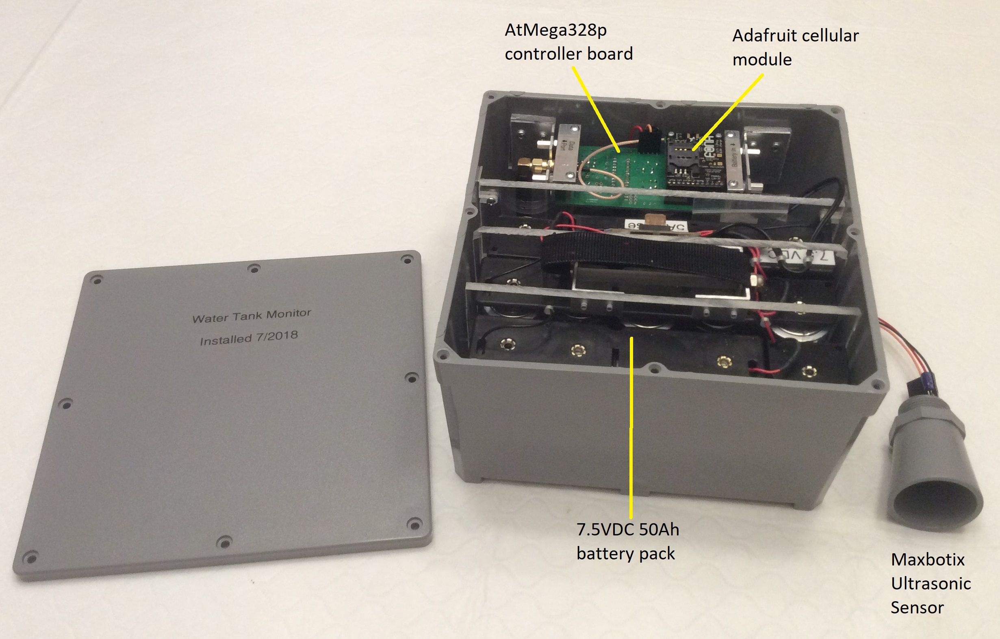

# Water Tank Monitor
Monitors the water level in a tank that supplies the daily water to the Lion of Judah Academy campus of over 800 students.

Battery-powered IoT endpoint that posts data to a server via a cellular module.
Design goals:
1. run on batteries for **5 years**
2. post data to a server on the half hour
3. REPL over TCP/IP

## System details
Water level is measured using an ultrasonic distance sensor in the roof of the tank. It measures the
distance from the top of the tank to the surface of the water.

The key to running on batteries for a long time is the ability for the system to go into deep sleep.
The water level doesn't change quickly, so the system can sleep for several minutes between readings.
Power to the ultrasonic sensor and cellular module is switched on and off by a FET under microcontroller control. These devices get no power when the unit is sleeping.
